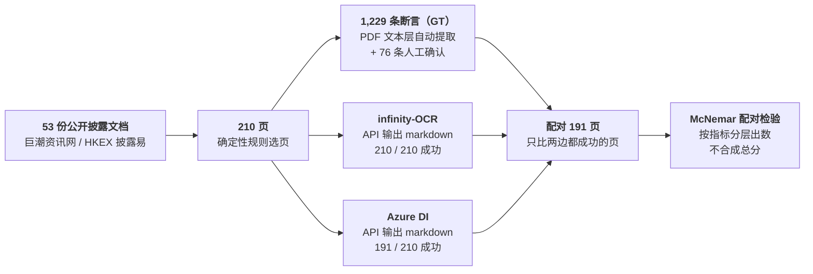

# infinity-OCR 评估简报

> 本文件是 `briefing-deck.html` 的 Markdown 版，内容与幻灯片一致，一页对应一节。
> 结构：结论与决策 → 关键数据 → 测试方法 → 对比结果 → 局限与待补项。每页标题就是该页结论。
> 图例：🟢 可以 / 支持　🔴 不可以 / 不支持　🟡 证据不足或未对照　⚪ 未覆盖

---

## 1 / 5　解析质量不构成替代理由；港股披露与 A 股公告关键字段未见差异，A 股报表页现阶段不可替代

*INFINITY-OCR vs AZURE DOCUMENT INTELLIGENCE · 技术评估简报 · 2026-09-28*

### 三条结论

| | 结论 | 关键数字 |
|---|---|---|
| **①** | **质量：没有一项指标 Infinity 更好** | 金额 97.5% vs Azure **100%**；正文完整性 93.1% vs **97.1%**（均为显著差异） |
| **②** | **风险：A 股报表页会静默丢表** | 3 页整段丢表，共 **27 个金额**，调用照常「正常结束」，没有任何报错 |
| **③** | **工程：不返回置信度，价格未知** | 没法按置信度挑字段复核；按 token 计费时，单价要低于 **$1.13 / 百万 token** 才与 Azure 牌价持平 |

### 按文档类型

| 🟢 关键字段未见差异 | 🔴 现阶段不可替代 | 🟡 / ⚪ 不下结论 |
|---|---|---|
| 港股年报 / 中报 / 招股书；A 股临时公告 | A 股年报 / 中报报表附注页；依赖置信度分流复核的流程；Word / Excel / PPT / HTML 原生文件 | 港股 KYC、扫描件（样本不足或未对照）；贸易金融单证（未覆盖） |

### 对决策的含义

> **替代的理由只能来自成本或私有化部署，不能来自解析质量。**
> 成本一项要等厂商书面答复**报价**；版本不可锁定则结论无法复现（待答复项见第 5 页）。

*样本：53 份公开披露文档 → 210 页 → 1,229 条断言，配对 191 页　·　出处：[evaluation-report.md](evaluation-report.md) §1*

---

## 2 / 5　Azure 在金额和正文两项上显著更好，没有一项 Infinity 更好

*同一批 191 页、同一套断言配对比较*

### 四个数字

| 金额准确 | 静默丢表 | 置信度 | 成本盈亏点 |
|:---:|:---:|:---:|:---:|
| **97.5%** vs **100%** | **27** 个金额 · 3 页 | **无** vs **每个片段都有** | **$1.13** / 百万 token |
| Infinity vs Azure | Infinity，无报错信号 | Infinity vs Azure | 低于此价才与 Azure $10/千页持平 |

### 断言通过率（Infinity vs Azure）

| 指标 | n | Infinity | Azure DI | 差异 |
|---|---|---|---|---|
| **金额** 数值原样出现、次数正确 | 486 | 97.5% | **100%** | 🔴 显著（0 : 12，p = 0.0005） |
| **正文完整性** 每页抽 3 行正文原样输出 | 448 | 93.1% | **97.1%** | 🔴 显著（2 : 20，p = 0.0001） |
| **单位与币种** 「单位：元」等是否保留 | 93 | 98.9% | 100% | 未观察到显著差异 |
| **金额与科目同行** | 76 | 100% | 98.7% | 未观察到显著差异 |

*「0 : 12」= 只有 Infinity 对的条数 : 只有 Azure 对的条数。Infinity 金额的 12 条失败逐条核对：8 条真实遗漏，4 条是减号字形不同。*

### 全量金额扫描：两边都会缺，性质不同

| | Infinity | Azure DI |
|---|---|---|
| 配对 54 页、1,544 个金额中缺失 | 11 个 · 2 页 | 6 个 · 2 页 |
| 原因 | **已查实**：页首续表整段没输出；重复 3 次缺的完全一样 | 待查 |
| 配对集外 | 另有 1 页整张表（16 个金额）不见了 | 该页网关失败，无法对比 |

*页级比较未观察到显著差异；两边的发生频率需要更大样本的定向测试才能确定　·　出处：[test-results.md](test-results.md)*

---

## 3 / 5　同一批页、同一套标准、配对比较：每个数字都可以复现

*测试方法*

### 流程

### 为什么可信

| | |
|---|---|
| **数据公开** | 全部来自公开披露渠道，任何人可以下载同一批文档 |
| **口径一致** | 两边用同一套断言判定，我方不对输出做任何转换；标点差异单独用宽松口径处理并列出 |
| **过程可追溯** | Infinity 每次调用的原始响应（状态码、耗时、`finish_reason`、模型回显）全量落盘；Azure 侧数字带校验和 |
| **不凑总分** | 不合成加权总分；n < 30 的分层写「样本不足」，不下结论 |
| **自我纠错** | 第一轮「Infinity 91.3% vs Azure 72.5%」查明是 Azure 全角转半角造成的，已作废 |

### 测不到什么

版面坐标定位（断言不含坐标）、贸易金融单证（无合规公开样本）、扫描件的双边对照。
公共基准 olmOCR-Bench 另跑了 41 页，作为参照，不进正文结论。

*出处：[evaluation-report.md](evaluation-report.md) 附录 C　·　[test-results.md](test-results.md)*

---

## 4 / 5　差别在出错时：Azure 会报不确定，Infinity 照常交付

*对比结果 · 按文档类型与技术路线*

### 按文档类型（PDF）

| 文档类型 | 判断 | 依据 |
|---|---|---|
| 港股年报 / 中报 / 招股书 | 🟢 **关键字段未见差异** | 金额、科目归属断言两边都没有失败 |
| A 股临时公告 | 🟢 **关键字段未见差异** | 金额断言两边都没有失败 |
| A 股年报 / 中报报表附注页 | 🔴 **现阶段不可替代** | Infinity 页首续表页确定性丢表，无报错；Azure 也缺 6 个，原因待查 |
| 港股 KYC 类文件 | 🟡 证据不足 | 只有 39 条正文断言，没有金额断言 |
| 扫描件 / 倾斜件 | 🟡 未与 Azure 对照 | Infinity 倾斜 2° 的页无限复读，打满 32k token，输出作废 |
| 贸易金融单证 | ⚪ 未覆盖 | 现有结论不能外推 |

### 影响决策的四项差异

| | infinity-OCR（VLM） | Azure DI（OCR 流水线） |
|---|---|---|
| **置信度** | 🔴 无，请求 `logprobs` 被静默忽略 | 🟢 每个文本片段都有 |
| **认不出时** | 🔴 漏掉或生成内容，调用照常正常结束 | 🟢 给低置信度或留空 |
| **版本** | 🔴 只看得到别名 `inf-mllm`，型号与版本不可知 | 🟢 有 API 版本号，可指定 |
| **文件格式** | 🔴 只收 PDF 和图片 | 🟢 另支持 Word / Excel / PPT / HTML |

*另：Infinity 为开源权重（Apache-2.0），可私有化部署，这是替代动因的可能来源之一　·　出处：[evaluation-report.md](evaluation-report.md) §1.2、§3*

---

## 5 / 5　局限与待补项：以下各项补齐前，结论不外推

*本轮评测的边界*

### 厂商尚未书面答复

- 被测型号与**版本**：服务端只回显别名 `inf-mllm`，评测期间是否变更不可知
- **计费方式**与报价：没有报价，成本对比无法落地
- 能否提供**置信度**
- 生产**吞吐与 SLA**：测试端点 1.6–5.6 页/分，加并发无效

### 本轮数据尚未回答

- Azure 在 A 股金额页缺失的 6 个金额，原因待查
- 正文完整性按文档族拆分的结果待出（目前只有总体结论）
- 「页首续表」丢表的发生频率：目前 3 页，需要定向扩大样本
- 港股 KYC、扫描件 / 倾斜件：样本不足或未与 Azure 对照
- 贸易金融单证：无合规公开样本，未覆盖

### 详细材料

| 文件 | 内容 |
|---|---|
| [test-results.md](test-results.md) | 测试集构成、GT 来源、各项指标与逐条失败明细、服务数据、数字出处 |
| [evaluation-report.md](evaluation-report.md) | 结论与依据、按文档类型的判断、结构性差异、评测局限、评测方法（附录 C） |

*出处：[evaluation-report.md](evaluation-report.md) §1.2、§2　·　[working/vendor-questions.md](working/vendor-questions.md)*
