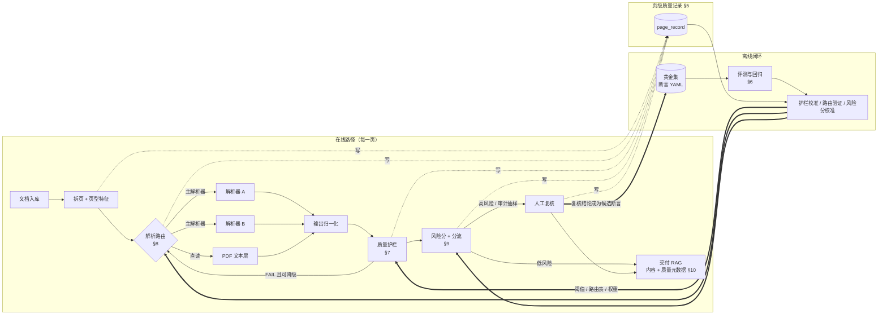
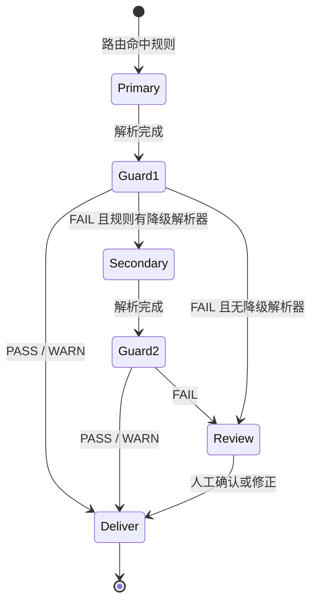

# 文档智能可靠性工程：总体架构设计

| 项 | 内容 |
|---|---|
| 状态 | **草案，待设计评审**（评审要拍板的事项集中在 §12） |
| 日期 | 2026-10-08 |
| 读者 | 技术主管、文档智能组、RAG 组 |
| 范围 | 文档解析的离线评测、在线质量护栏、解析路由、人工复核分流，以及四者之间的数据闭环 |
| 前置材料 | `docs/evaluation-report.md`（本设计的证据来源）、`docs/working/sdk-findings.md`、`docs/working/t0-findings.md` |

**本文的写法约定**沿用评测项目（CLAUDE.md 约定 5、6）：
标 **[已测]** 的是本仓库评测里有原始响应可查的结论；标 **[假设]** 的是设计依据但尚未验证的判断，
每条假设都对应一个验证步骤。不合成加权总分。

---

## 1. 背景：为什么要做这件事

这轮 Infinity-Parser2 对 Azure DI 的评测，结论之外留下了三个**任何解析器都会有**的问题：

1. **解析失败不一定报错。** [已测] Infinity 在 3 页上把页首续表整段丢掉，`finish_reason=stop`，
   重复调用三次结果完全一样（`evaluation-report.md` §2.3–2.4）。Azure 在配对页上也有 2 页缺了 6 次金额，原因待查。
   现在的入库流程对这类失败**完全没有感知**——下游 RAG 拿到的是一页「看起来正常」的残缺内容。
2. **没有一家解析器在所有页型上都更好。** [已测] 自建集上正文完整性 Azure 更好（97.1% 对 93.1%）；
   ParseBench 上 Tables Azure 更高（−6.5，p=0.003），Content Faithfulness Infinity 更高（+4.0，p<0.001）；
   Office 原生文件 Infinity 不接受（SDK 源码核实）。单一解析器是在用一家的短板覆盖所有页。
3. **没有置信度，就只能全量复核或盲目抽检。** [已测] Infinity 不返回置信度，`logprobs` 被静默忽略。
   人工复核成本远高于调用成本（`evaluation-report.md` §4.3），选不准复核对象，成本就降不下来。

本设计把这次的一次性评测，变成每一页文档在生产里都会走一遍的流程。

## 2. 目标与非目标

### 2.1 目标

| # | 目标 | 可验收的形式 |
|---|---|---|
| G1 | 换解析器 / 换版本时，一天内拿到分层对比结论 | 一条命令出版本化报告（§6） |
| G2 | 生产中每一页都有一个可信度判断，静默失败可被发现 | 每项护栏在黄金集上的召回率与误报率，带 95% CI（§7.4） |
| G3 | 每一页交给更适合它的解析器 | 路由策略在黄金集上的「关键字段错误率 × 每千页成本」对比，相对单一解析器（§8.5） |
| G4 | 用最少的人工抓住最多的错误 | 复核率—错误捕获率曲线，业务方在曲线上选点（§9.3） |
| G5 | 人工复核结果回流，系统随时间变准 | 复核结论自动成为黄金集候选，定期重新校准（§9.5） |

### 2.2 非目标

- **不自研解析模型。** 本设计假设解析器是外部能力（API 或开源权重），我们做的是解析器之外的可靠性层。
- **不做 RAG 的检索与生成。** 只负责交给 RAG 的每一页「内容 + 质量元数据」，接口见 §10。
- **不合成「文档质量总分」。** 风险分只用于排序复核队列，不对外作为质量指标报告（§9.2）。
- **第一期不做实时（同步）解析。** 先做批处理入库，延迟要求见 §11。

## 3. 术语

| 术语 | 含义 |
|---|---|
| 页级质量记录 | 每一页一条的结构化记录，四个组件都往里写，是整个系统的骨架（§5） |
| 黄金集 | 带人工确认标准答案（断言）的页集合，用于评测、护栏校准、路由验证 |
| 断言 | 一条可自动判定的 pass/fail 规则，schema 见 `docs/working/assertions.md` |
| 护栏 / 检查项 | 不依赖标准答案、在线对每一页运行的质量检查（§7） |
| 静默失败 | 解析结果有业务错误（漏金额、丢表、截断），但调用状态正常 |
| 关键字段 | `amount`、`amount_label`、`unit_currency` 三类断言覆盖的字段；业务上出错就是事故 |
| 路由 | 按页型选择解析器，以及护栏失败后的降级路径（§8） |
| 风险分 | 由护栏信号合成的页级分数，只用于决定是否送人工、排队顺序（§9） |

## 4. 总体架构

### 4.1 架构图



### 4.2 组件职责

| 组件 | 输入 | 输出 | 何时运行 | 设计章节 |
|---|---|---|---|---|
| 页级质量记录 | 各组件的写入 | 一页一条记录 | 始终 | §5 |
| 评测与回归 | 黄金集 + 某个解析器配置 | 分层报告 + 回归门禁结论 | 换解析器 / 换版本 / 定期 | §6 |
| 质量护栏 | 原始页 + 解析输出 + 调用元数据 | 每项检查 PASS/WARN/FAIL/N/A | 每一页 | §7 |
| 解析路由 | 页型特征 + 护栏结果 | 选用哪个解析器、是否降级 | 每一页 | §8 |
| 风险分与分流 | 护栏结果 + 页型 | 风险分、是否送人工 | 每一页 | §9 |
| 人工复核 | 高风险页 + 审计抽样页 | 对/错 + 错误类型 + 修正 | 被分流的页 | §9.4 |
| 校准 | 黄金集 + 质量记录 | 新阈值、路由表、风险分权重 | 定期 / 黄金集变化后 | §6–§9 |

### 4.3 设计原则

1. **记录先于逻辑。** 所有判断都写进页级质量记录，任何一次交付都能回答「这一页走了哪个解析器、哪些检查过了、谁看过」。
   这是评测项目「原始响应全量落盘」原则的生产化版本。
2. **每个组件都要能被评测。** 护栏有召回率和误报率，路由有质量—成本对比，风险分有复核曲线。
   没有评测数字的组件不上线。
3. **规则优先，模型其次。** 第一期护栏、路由、风险分都用可解释的规则或简单的逻辑回归。
   理由：黄金集里真实失败样本很少（§7.4），复杂模型没有足够的数据去训练和验证。
4. **配置即数据。** 阈值、路由表、风险分权重都是带版本号的配置文件，不写死在代码里；改配置等同于发版，要过回归。
5. **确定性失败不重试同一个解析器。** [已测] 续表丢失和复读退化在重复调用中都 100% 复现（`evaluation-report.md` §2.4、§3），
   重试只会多花钱。失败后的动作是降级到另一个解析器或送人工（§8.4）。
6. **数据不出公司环境。** 真实业务文档、质量记录、复核结果都只在公司环境里存储和处理。仓库里只放代码、schema 和公开数据。

---

## 5. 第 0 步：页级质量记录

### 5.1 为什么先做它

后面四个组件互相依赖的唯一媒介就是这张表：护栏读路由的结果，风险分读护栏的结果，校准读所有人的结果。
**先把表定下来，各组件可以并行开发**；表不定，每个组件各存各的，闭环就接不上。

### 5.2 记录结构

一页一条记录，主键 `page_id`。按写入方分组：

```yaml
# ---- 标识（入库时写）----
page_id: "doc_7f3a…:p0225:a1"   # doc_id + 物理页号 + 处理尝试序号（attempt）
doc_id: "doc_7f3a…"              # 原文件 sha256 前缀，同一文件重复入库得到同一 doc_id
doc_family: a_share_annual        # 文档族，取值表见 §5.3
page_no: 225                      # 物理页，1-based
attempt: 1                        # 同一页的第几次处理（降级重试时递增）
ingested_at: "2026-10-08T03:12:44Z"
pipeline_version: "0.1.0"         # 本系统代码版本
config_version: "routing-v3/guard-v5/risk-v2"   # 三份配置各自的版本

# ---- 页型特征（拆页时写，§8.2）----
features:
  file_format: pdf                # pdf | image | docx | xlsx | pptx | html
  has_text_layer: true
  text_layer_chars: 2841
  digit_ratio: 0.31
  table_cue_score: 0.8            # 文本层里「连续空格分隔的数字列」线索，算法同 select_pages.py
  starts_with_table_rows: true    # 页首是否是无表头的数字行（续表候选）
  skew_deg: 0.0                   # 仅扫描件 / 图片
  rendered_px: 3579904
  lang: zh

# ---- 路由（§8）----
route:
  rule_id: R4                     # 命中的路由规则
  parser: azure_di_layout         # 本次 attempt 实际使用的解析器
  parser_version_echo: "2024-11-30"   # 服务端回显的版本；Infinity 只回显别名 inf-mllm
  fallback_from: null             # 若是降级而来，记上一次的 page_id

# ---- 调用元数据（解析后写）----
call:
  http_status: 200
  finish_reason: stop             # Azure 无此字段时为 null
  input_tokens: 8868
  output_tokens: 984
  latency_ms: 22500
  cost_estimate: 0.0376           # 按配置里的单价估算，单位与币种在配置里
  raw_ref: "s3://…/raw/doc_7f3a…_p0225_a1.json"   # 原始响应全量落盘的位置

# ---- 护栏结果（§7）----
checks:
  - {id: C1, status: PASS}
  - {id: T1, status: FAIL, detail: {expected: 18, found: 10, missing: ["1,234.56", "…"]}}
  - {id: S1, status: WARN}
  - {id: X1, status: N/A, reason: "未双跑"}
guard_status: FAIL                # 全部检查的汇总：任一 FAIL 即 FAIL，否则任一 WARN 即 WARN

# ---- 风险与分流（§9）----
risk:
  score: 0.87
  model_version: risk-v2
  decision: review                # pass | review | audit_sample
  reason: ["T1 FAIL", "续表页"]

# ---- 人工复核（§9.4）----
review:
  reviewer: "u_xxx"               # 内部工号的不可逆映射，不存姓名
  reviewed_at: "…"
  verdict: wrong                  # correct | wrong | unsure
  error_types: [amount_missing]   # 取值与断言七类对齐，见 §9.4
  corrections_ref: "…"            # 修正内容的存储位置
  promoted_to_gold: false         # 是否已转为黄金集断言（§9.5）

# ---- 交付（§10）----
delivered:
  to: rag_ingest
  at: "…"
  content_sha256: "…"
  quality_status: verified        # verified | passed | warned | unreviewed_fail
```

### 5.3 枚举与约定

| 字段 | 约定 |
|---|---|
| `doc_family` | 沿用评测项目的文档族划分（`data/assertions/*.yaml` 的 `family`），新业务文档族按需扩展，**扩展要过评审**，因为分层出数依赖它 |
| `checks[].status` | `PASS` / `WARN` / `FAIL` / `N/A`。`N/A` 必须带 `reason`，不允许静默跳过 |
| 时间 | 一律 UTC，ISO 8601 |
| 版本 | `pipeline_version` 跟代码，`config_version` 跟配置；两者任一变化，历史记录不改写，新记录用新版本 |
| 不可变性 | 记录只追加不修改。降级重试产生新 `attempt`，复核结论追加到对应 attempt |

### 5.4 存储与保留

- **第一期**：每批一个 Parquet 文件（或公司已有的关系库表），原始响应单独落对象存储，记录里只存引用。
  选型待评审（§12 D1）。
- **保留期**：质量记录长期保留（体量小，是校准的原料）；原始响应按公司数据保留政策。
- **敏感信息**：记录里不存页面正文，只存哈希和引用；复核人只存不可逆标识。

### 5.5 与现有代码的关系

`tools/runner.py` 已经把每次调用的 HTTP 状态码、响应头、`usage`、`finish_reason`、UTC 时间戳、服务端回显的 `model`
落成 `runs/<run_id>/raw/<doc>_p<page>.json`。页级质量记录的「调用元数据」一组**直接从这个文件派生**，
不需要改 runner 的落盘格式，只需要加一个汇总步骤，把 raw 文件、`check.py` 的结果、页型特征合成记录表。

### 5.6 验收

- 用现有 `runs/` 下的 Infinity 210 页、Azure 191 页（配对集）生成完整的记录表，字段齐全、无 null 主键。
- 任取一页，能从记录追溯到原始响应、命中的断言、选页规则。

---

## 6. 第 1 步：评测与回归

### 6.1 定位

评测项目做的是「一次性的厂商对比」。这里要变成**常驻的回归测试**：
任何解析器、解析器版本、路由配置、归一化规则的变化，都先过这一关。

### 6.2 黄金集

| 层 | 来源 | 规模 | 用途 | 存放 |
|---|---|---|---|---|
| 公开层 | 现有自建集：53 份公开文档、210 页、1,229 条断言 | 已有 | 方法开发、可对外复现 | 本仓库 `data/assertions/` |
| 业务层 | 组内真实业务文档，按文档族分层抽页 | 每族至少 30 页起，目标 100 页 | 上线判断的主依据 | **只在公司环境** |
| 定向层 | 已知难点的专项集：续表页、倾斜扫描件、密集数字表、Office 原生文件 | 每类至少 50 页 | 护栏召回率、路由规则验证 | 公开部分入库，业务部分留公司 |
| 回流层 | 人工复核确认的页（§9.5） | 持续增长 | 让黄金集覆盖生产中真实出现的失败 | 只在公司环境 |

**选页规则沿用 `tools/select_pages.py` 的确定性规则**，业务层加新文档族时同样要求规则公开、可复现。

**断言生成沿用三层口径**（`docs/working/assertions-method.md`）：`page_integrity` 全自动；
`amount`、`unit_currency` 脚本出草稿、人工在 `tools/review_assertions.py` 生成的审核页里确认。
**未经人工确认的草稿断言不参与判分**（`check.py` 现有行为）。

### 6.3 评测流水线

```
run_eval --parser <配置> --gold <黄金集版本> [--baseline <上一版本的报告>]
  1. runner        按解析器配置逐页调用，原始响应全量落盘          tools/runner.py, azure_di_runner.py
  2. normalize     统一归一化（U+2212→"-"、全角半角）              新增，规则来自 relaxed_recheck.py
  3. check         断言判分，严格 + 宽松两种口径                    tools/check.py, relaxed_recheck.py
  4. amount_scan   全量金额对账（不抽样）                           tools/amount_scan.py
  5. consistency   可选：重复调用一致性                             tools/consistency.py
  6. compare       与基线配对比较，McNemar / 符号检验，按族分层     tools/compare_systems.py
  7. report        版本化报告：黄金集版本 + 解析器版本 + 配置版本 + 时间
```

现有工具覆盖了 1、3、4、5、6；**要新增的是 2（把归一化从判分阶段挪到流水线里）、7，以及把它们串起来的入口**。

### 6.4 指标

| 指标 | 定义 | 分层 |
|---|---|---|
| 关键字段错误率 | 关键字段断言中，人工裁定为业务错误的比例（排除标点字形差异，口径同 `evaluation-report.md` §2.3） | 按文档族 |
| 静默失败页率 | 有关键字段错误、且 `finish_reason=stop`、且无任何报错的页 / 总页数 | 按文档族、按页型 |
| 正文完整性 | `page_integrity` 宽松口径通过率 | 按文档族 |
| 调用失败率 | 非 200 或 `finish_reason=length` 的页 / 总页数 | 按解析器 |
| 结论翻转率 | 重复调用间断言 pass/fail 翻转的比例 | 按断言类型 |
| 每千页成本 | 实测 token × 配置单价，或按页计价 | 按解析器 |

**不合成总分**；分层 n < 30 写「样本不足」；p ≥ 0.05 写「未观察到显著差异」，不写「持平」。

### 6.5 回归门禁

| 门禁 | 条件 | 动作 |
|---|---|---|
| 硬门禁 | 任一文档族的关键字段错误页数显著多于基线（配对 McNemar，p < 0.05） | 阻止上线 |
| 硬门禁 | 静默失败页率上升，且新增失败页人工确认为业务错误 | 阻止上线 |
| 软门禁 | 正文完整性下降但不显著；调用失败率上升 | 上线需负责人签字 |
| 信息项 | 成本、延迟变化 | 进报告，不拦截 |

阈值是建议起点，由业务方定（§12 D4）。

### 6.6 验收

- 用现有数据复现评测报告 §2.2 的配对对比表，数字逐位一致。
- 对同一解析器跑两次，报告给出「未观察到显著差异」，证明门禁不会被非确定性误触发
  （[已测] Infinity 断言结论翻转 0.17%）。

---

## 7. 第 2 步：质量护栏

### 7.1 定位

生产环境里没有断言可比。护栏回答的是：**在没有标准答案的情况下，这一页的解析结果能不能信。**

### 7.2 检查项目录

按信号来源分四层，成本从低到高。每项都有编号，质量记录、风险分、复核界面都用这个编号引用。

#### C 层：调用元数据（所有页，几乎零成本）

| ID | 检查 | FAIL / WARN 条件（初始值，待校准） | 针对的失败 | 证据 |
|---|---|---|---|---|
| C1 | 截断 | `finish_reason=length` → FAIL | 复读退化、输出超长 | [已测] 2 次退化都打满 32,768 token |
| C2 | 空输出 | 输出去空白后为空 → FAIL | 调用成功但没内容 | [已测] ParseBench 500 份中 Infinity 有 4 份 |
| C3 | 输出长度异常 | 输出字符数 / 文本层字符数 < 0.5 → WARN；> 3 → WARN | 大段遗漏；重复生成 | [假设] 比值的正常范围要在黄金集上定 |
| C4 | 重复生成 | 输出中最高频 n-gram（n=8）占比 > 阈值 → FAIL | 未打满上限的复读 | [假设] 复读在打满上限前可被识别 |
| C5 | 调用失败 | 非 200、超时、网关错误 → FAIL | 基础设施失败 | [已测] Azure 210 页中 19 页基础设施失败 |
| C6 | 版本漂移 | 服务端回显的 `model` / API 版本与配置登记不一致 → WARN（整批告警） | 厂商静默换模型 | [已测] Infinity 只回显别名，换版本无法从响应识别，所以这一项对 Infinity 只能检查别名 |

#### T 层：对照 PDF 文本层（只适用于有文本层的电子版 PDF）

| ID | 检查 | FAIL / WARN 条件 | 针对的失败 | 证据 |
|---|---|---|---|---|
| T1 | 金额全量对账 | 文本层中每个金额在输出中的出现次数不少于文本层；缺失 ≥ 1 → FAIL | 整表丢失、漏行 | [已测] `amount_scan.py` 在配对集上发现 Infinity 2 页、Azure 2 页缺失 |
| T2 | 锚点覆盖率 | 从文本层自动取锚点（长度 ≥ 12、全页唯一，同 `page_integrity`），宽松口径下覆盖率 < 阈值 → WARN / FAIL | 段落遗漏 | [已测] 宽松口径下 Infinity 31 条、Azure 13 条真实缺失候选 |
| T3 | 表格存在性 | 文本层表格线索强（`table_cue_score` 高）但输出中无表格结构 → WARN | 表格被拍平成文字 | [已测] olmOCR-Bench 上未识别成表的页，单元格通过率 8.3%（识别成表的页 90.6%） |
| T4 | 单位币种 | 文本层有「单位：元 / RMB'000」类表头，输出中没有 → FAIL | 单位丢失（下游金额量级全错） | 断言类型 `unit_currency` |

**T 层的已知盲区**（必须写进上线说明，不能假装全覆盖）：
- 扫描件、图片没有文本层，T 层全部 `N/A`。
- [已测] `amount_scan.py` 只认 A 股写法（千分位 + 两位小数），港股无小数写法是盲区，需要扩展规则。
- [已测] 文本层本身可能出错：人工审计抽样 53 条金额改过 1 条，GT 错误率估计 1.9% [0.3, 9.9]。T 层的 FAIL 要允许人工推翻。

#### S 层：结构规则（所有页）

| ID | 检查 | 条件 | 针对的失败 | 证据 |
|---|---|---|---|---|
| S1 | 续表页 | `starts_with_table_rows=true` 且输出开头不是表格内容 → FAIL；续表页本身 → 风险加权 | 页首续表整段丢失 | [已测] Infinity 3 页丢表的共同点都是页首续表 |
| S2 | 页眉页脚 | 业务需要页眉页脚信息（公司名、报告期），而输出中没有 → WARN | 上下文丢失 | [已测] SDK 默认丢弃 header/footer（`sdk-findings.md`） |
| S3 | 格式归一化 | 不是检查，是在护栏前统一执行：U+2212→"-"、全角半角、空白 | 避免把字形差异当错误 | [已测] 第一轮结论被标点差异整体反转 |

#### X 层：交叉验证（成本高，按需触发）

| ID | 检查 | 触发条件 | 针对的失败 | 证据 |
|---|---|---|---|---|
| X1 | 双解析器比对 | 高价值文档族、或扫描件（T 层不可用时的替代）。两家输出的金额集合、表格数不一致 → WARN | 单一解析器的盲区 | [假设] 两家的错误不完全重叠（配对集 p170 两边都缺，但缺的是不同的金额） |
| X2 | 解析器自带置信度 | 解析器提供置信度时（Azure 逐 span 给），低置信度 span 落在关键字段上 → WARN | OCR 识别不确定 | [已测] 只有 Azure 提供；Infinity 不提供 |
| X3 | 重复调用 | 只用于诊断，不默认开启 | 非确定性 | [已测] Infinity 逐字一致 99.0%、金额类零翻转，在线开启性价比低 |

### 7.3 检查项的统一接口

```python
class Check(Protocol):
    id: str                      # "T1"
    applies_to: Callable[[PageFeatures], bool]   # 不适用时返回 N/A 并给出原因
    def run(self, page: PageInput, output: ParsedOutput, call: CallMeta) -> CheckResult: ...

@dataclass
class CheckResult:
    id: str
    status: Literal["PASS", "WARN", "FAIL", "N/A"]
    detail: dict                 # 证据：缺了哪些金额、比值是多少，复核界面直接展示
    reason: str | None = None    # N/A 时必填
```

每项检查**必须返回可读的证据**（`detail`）。复核人看到的不是「T1 FAIL」，
而是「文本层有 18 个金额，输出里找到 10 个，缺这 8 个」，这样复核才快。

### 7.4 护栏自身的评测（本设计最关键的一节）

护栏加上去不难，难的是**证明它有用、又不至于天天误报**。每项检查都要给出：

| 指标 | 定义 | 数据来源 |
|---|---|---|
| 召回率 | 已知坏页中，该检查报 FAIL / WARN 的比例 | 真实失败页 + 注入失败页 |
| 误报率 | 已确认无关键错误的页中，该检查报 FAIL 的比例 | 黄金集中全部通过的页 |
| 增量召回 | 加上这一项后，整体护栏多抓到的坏页 | 按检查项逐个累加 |

**正样本不够怎么办**：黄金集里真实的失败页很少——[已测] Infinity 关键字段错误只集中在 2–3 页，复读退化 2 次。
按约定，n 这么小时只能写「样本不足」。所以召回率分两部分报，**不合并**：

1. **真实失败召回**：在已查实的失败页上逐页列出哪些检查抓到了。只列事实，不算百分比。
   例：评测项目里 Infinity 丢表的 3 页，T1 是否都抓到？S1 是否都抓到？
2. **注入失败召回**：对通过的页人工制造失败，测召回率，带 95% CI。注入方式与真实失败对应：

   | 注入方式 | 模拟的真实失败 | 主要考验的检查 |
   |---|---|---|
   | 删掉输出开头的表格行 | 页首续表丢失 | S1、T1 |
   | 删掉一整张表 | 整表丢失 | T1、T3、C3 |
   | 把表格转成一段散文 | 表格被拍平 | T3 |
   | 截断输出后 30% | 截断 | C3、T2 |
   | 循环复制一段文字 | 复读退化 | C4 |
   | 删掉单位行 | 单位丢失 | T4 |

   **注入召回率是上限估计**：注入的失败比真实失败更「干净」。报告里两种召回率并列，并注明这一点。

**误报率的底线**：误报直接变成人工复核量。建议的初始门槛是**单项误报率 95% CI 上界 ≤ 5%**，
否则该项降级为 WARN 或不上线。门槛由评审定（§12 D4）。

### 7.5 验收

- 在公开黄金集（Infinity 210 页 + Azure 191 页）上，产出每项检查的「真实失败逐页表 + 注入召回率 + 误报率」。
- 评测报告里已查实的每一个静默失败页，**至少被一项检查抓到**；抓不到的写清楚原因和对应的盲区。

---

## 8. 第 3 步：解析路由

### 8.1 定位

按页型把每一页交给最合适的解析器；护栏失败时降级。路由表的每一行都要有黄金集上的证据支撑。

### 8.2 页型特征

全部在调用解析器之前、用便宜的方法算出（主要靠 PyMuPDF 读文本层与页面属性）：

| 特征 | 计算方式 | 用途 |
|---|---|---|
| `file_format` | 扩展名 + 文件头 | Office / HTML 只能交给支持原生格式的解析器 |
| `has_text_layer`、`text_layer_chars` | 文本层字符数 | 区分电子版与扫描件 |
| `digit_ratio`、`table_cue_score` | 同 `select_pages.py` 的打分逻辑 | 识别含表页 |
| `starts_with_table_rows` | 页首若干行是否是无表头的数字行 | 识别续表页 |
| `skew_deg` | 扫描件倾斜角估计 | [已测] 倾斜 2° 触发过复读退化 |
| `doc_family` | 来源系统给出，或按标题规则分类 | 分层统计、按族路由 |

### 8.3 路由表 v0

以下规则的依据都来自本仓库评测；**标 [假设] 的行上线前必须在业务黄金集上验证**。

| 规则 | 条件 | 主解析器 | 降级 | 依据 |
|---|---|---|---|---|
| R1 | Office / HTML 原生文件 | 支持原生格式的解析器（如 Azure） | 人工 | [已测] Infinity 只接受 PDF 与图片 |
| R2 | 电子版纯文字页（有文本层、无表格线索） | 文本层直读 + 版面结构解析器 | 另一个解析器 | [假设] 文本层直读最便宜也最准，但阅读顺序与段落结构要解析器补 |
| R3 | 电子版含表页 | 表格指标更好的一方 | 另一方 | [已测] ParseBench Tables Azure 更高；自建集正文完整性 Azure 更好 |
| R4 | 续表页 | 同 R3，且强制运行 S1、T1 | 另一方 → 人工 | [已测] Infinity 的 3 页丢表全是续表页 |
| R5 | 扫描件 | **待测** | 双解析器比对（X1） | 本轮没有和 Azure 在扫描件上做对照 |
| R6 | 倾斜扫描件 | 先做倾斜校正再走 R5 | 人工 | [已测] Infinity 在倾斜 2° 时复读退化 |
| R0 | 兜底 | 现状方案 | 人工 | — |

路由表是带版本号的配置文件（YAML），不写死在代码里：

```yaml
version: routing-v0
rules:
  - id: R4
    when: {has_text_layer: true, starts_with_table_rows: true}
    primary: azure_di_layout
    fallback: [infinity_parser2_flash, human]
    force_checks: [S1, T1]
```

### 8.4 降级状态机



- **同一解析器不重试**（原则 5）。例外只有 C5 基础设施失败（超时、网关错误），允许同一解析器重试 1 次。
- 每一次尝试都是一条独立的质量记录（`attempt` 递增），降级链可以完整追溯。
- 降级会增加成本：每条降级都记 `cost_estimate`，在 §8.5 的成本里计入。

### 8.5 路由的评测

在黄金集上比三种（或更多）策略，**每一种都是同一批页**：

| 策略 | 每族关键字段错误率 | 静默失败页率 | 送人工页率 | 每千页成本 |
|---|---|---|---|---|
| 只用 A | | | | |
| 只用 B | | | | |
| 路由 v0 | | | | |

- 不合成总分：路由在某一族上更差，就单独报出来，而不是被别的族平均掉。
- 成本用实测 token 与报价（[已测] Flash 牌价每千页约 ¥38；Azure 牌价 $10 / 千页，**应以实际合同价为准**）。
- **上线方式：先影子运行。** 生产流量照旧走现状方案，路由策略在旁边跑同样的页、只记录不交付，
  在业务真实分布上对比两周后再切换。

### 8.6 验收

- 路由 v0 在公开黄金集上，没有任何一族的关键字段错误率显著差于「只用现状方案」。
- 影子运行两周，结果进入 §6 的回归报告格式。

---

## 9. 第 4 步：风险分与人工复核分流

### 9.1 定位

厂商不给置信度，我们自己造一个：**把护栏信号和页型合成页级风险分，用它决定哪些页给人看。**

### 9.2 风险分

- **v0：规则加权。** 任一 FAIL 直接送人工；WARN 按检查项给权重累加；续表页、扫描件、密集数字表等高风险页型额外加权。
- **v1：逻辑回归。** 特征 = 各检查项状态 + 页型特征；标签 = 人工复核或黄金集判分得出的「有无关键字段错误」。
  选逻辑回归而不是更复杂的模型，是因为标签少、要可解释（复核人要知道为什么这一页被送来）。
- 风险分**只用于排序和分流**，不对外报告成「质量分」，不跨文档族比较。

### 9.3 复核曲线与阈值

交付给业务方的不是一个阈值，而是一条曲线：

```
送人工的页比例（x 轴）  →  被抓住的关键字段错误比例（y 轴）
例：复核 __% 的页，抓住 __% 的错误（数字待实测，带 95% CI）
```

- 业务方按「漏一个错误的代价」和「人工成本」在曲线上选点。我们不替业务方定阈值。
- 曲线在黄金集上计算，**按文档族分别画**，样本不足的族写「样本不足」。

### 9.4 复核流程

| 环节 | 设计 |
|---|---|
| 入队 | 风险分超过阈值的页 + **低风险页的随机审计样本**（见下） |
| 排序 | 风险分从高到低；同一文档的页放在一起，减少切换成本 |
| 界面 | 左边原页面图，右边解析输出，高亮护栏的证据（缺了哪些金额、哪一段未覆盖）。原型是 `tools/review_assertions.py` |
| 结论 | `correct` / `wrong` / `unsure`；`wrong` 必须选错误类型 |
| 错误类型 | 与断言七类对齐：金额错 / 金额缺 / 科目归属错 / 单位币种错 / 跨页表格错 / 阅读顺序错 / 正文缺失 / 其他 |
| 修正 | 复核人可修正关键字段，修正结果随页交付，并标记 `quality_status=verified` |

**审计抽样是必须的，不是可选的。** 只看高风险页，就永远不知道低风险页里漏了多少错误——
护栏的盲区会一直是盲区。建议对 `decision=pass` 的页随机抽 1–2%（比例待评审，§12 D5），
用它估计**剩余错误率**（带 95% CI），这是对业务方承诺「放行的页有多可靠」的唯一依据。

### 9.5 回流：让系统随时间变准

```
复核结论（wrong + 错误类型 + 修正）
   ↓ 自动生成候选断言（金额 → amount，单位 → unit_currency，缺失段落 → page_integrity）
   ↓ 第二人确认（避免一个人的错误进入 GT）
黄金集回流层（§6.2）
   ↓ 定期（建议每月）或回流层新增超过 N 页时
重新校准：护栏阈值（§7.4）、路由表（§8.5）、风险分权重（§9.2）
   ↓ 新配置版本过 §6.5 回归门禁
上线
```

回流的风险与对策：

| 风险 | 对策 |
|---|---|
| 复核人自己判错，错误进入 GT | 候选断言需第二人确认；复核结论不直接改 GT |
| 回流样本偏向高风险页，校准有偏 | 校准时把审计抽样页单独作为无偏验证集 |
| 黄金集被「刷」到只覆盖已知问题 | 定期从生产中随机抽新页补进业务层 |

### 9.6 验收

- 在公开黄金集上画出复核曲线（v0 规则版），并给出审计抽样估计剩余错误率的计算方法。
- 走通一次完整回流：复核结论 → 候选断言 → 确认 → 进入黄金集 → 重新计算护栏召回率。

---

## 10. 与 RAG 的接口

RAG 组拿到的不只是文本，而是**文本加上它的质量元数据**。建议的交付格式（每页一条，切块时元数据随块继承）：

```json
{
  "doc_id": "doc_7f3a…",
  "page_no": 225,
  "content_md": "…",
  "quality_status": "passed",
  "parser": "azure_di_layout",
  "checks_failed": [],
  "checks_warned": ["S1"],
  "risk_score": 0.21,
  "page_record_id": "doc_7f3a…:p0225:a1"
}
```

| `quality_status` | 含义 | RAG 侧建议用法 |
|---|---|---|
| `verified` | 人工复核过 | 正常使用 |
| `passed` | 护栏全过，未人工复核 | 正常使用 |
| `warned` | 有 WARN，未人工复核 | 可使用；回答中引用该页时可附提示 |
| `unreviewed_fail` | 护栏 FAIL 且尚未复核（只在业务允许先入库后复核时出现） | 建议不进检索，或降权 |

**这个接口的价值**：RAG 回答错了，可以通过 `page_record_id` 一路追到「这一页走了哪个解析器、哪些检查没过、有没有人看过」，
把「检索的问题」和「解析的问题」分开。后续可以在这个基础上量化「解析错误对问答准确率的影响」（附录 C）。

---

## 11. 部署形态与非功能要求

| 项 | 第一期 | 说明 |
|---|---|---|
| 处理模式 | 批处理入库 | 按文档排队，页级并行 |
| 并发 | 按解析器分别限流 | [已测] Infinity 测试端点静默排队、无 429，吞吐 1.6–5.6 页/分且不随并发上升；限流必须由我们自己控制，不能指望服务端 |
| 延迟 | 不承诺单页延迟；承诺批次完成时间 | [已测] 一份 100 页文档在 Infinity 测试端点约 40–60 分钟；生产吞吐待厂商回答 |
| 凭证 | 只从环境变量 / 公司密钥服务读取 | 沿用 CLAUDE.md 约定 3 |
| 成本 | 每页估算成本写入质量记录，按日汇总 | 报价单单位、折扣含义仍是 [假设]（`evaluation-report.md` §4.3） |
| 可观测性 | 按日看：路由分布、各检查项触发率、送人工率、审计抽样剩余错误率、成本 | 检查项触发率突变是解析器静默换版本的最直接信号（补充 C6） |

---

## 12. 待评审决策点

| # | 决策 | 选项 | 建议 | 谁来定 |
|---|---|---|---|---|
| D1 | 质量记录的存储 | Parquet 文件 / 公司现有关系库 / 数据平台表 | 第一期 Parquet，跑通后迁移 | 技术主管 |
| D2 | 第一期纳入的解析器 | 只现状方案 / 现状方案 + 一个候选 | 现状方案 + 一个候选，否则路由与 X1 无从谈起 | 技术主管 |
| D3 | 第一期覆盖的文档族 | 全部 / RAG 组最痛的 2–3 族 | 先 2–3 族，每族黄金集至少 30 页 | RAG 组 + 业务方 |
| D4 | 回归门禁与护栏误报门槛 | 见 §6.5、§7.4 | 先用建议起点，跑一个月后复议 | 业务方 |
| D5 | 审计抽样比例 | 1% / 2% / 按族不同 | 2% 起步，剩余错误率 CI 收窄后下调 | 业务方 |
| D6 | 复核人与复核时效 | 组内 / 业务线 / 外包 | — | 业务方 |
| D7 | FAIL 页是否允许先入库后复核 | 允许（标 `unreviewed_fail`）/ 不允许 | 取决于 RAG 场景对时效的要求 | RAG 组 |
| D8 | 真实业务文档用于黄金集的数据审批 | — | 必须先过数据合规审批 | 合规 |
| D9 | Azure 实际合同价 | — | 路由的成本对比需要 | 采购 |

## 13. 落地计划

| 里程碑 | 内容 | 预计 | 退出标准 | 依赖 |
|---|---|---|---|---|
| M0 | 页级质量记录：schema 定稿 + 从现有 `runs/` 生成记录表 | 1 周 | §5.6 | 无，只用现有数据 |
| M1 | 评测流水线：串起现有工具 + 归一化 + 版本化报告 | 1–2 周 | §6.6 | M0 |
| M2 | 护栏 C/T/S 层 + 护栏自身评测 | 2 周 | §7.5 | M0；公开黄金集 |
| M3 | 接入 RAG 组：业务黄金集首批 + §10 接口 + 护栏影子运行 | 2 周 | 业务黄金集每族 ≥ 30 页；影子运行出日报 | **D3、D8 审批**；RAG 组配合 |
| M4 | 路由 v0 + 降级状态机 + 影子运行 | 1–2 周 | §8.6 | M2；D2 |
| M5 | 风险分 v0 + 复核曲线 + 审计抽样 + 回流闭环 | 2 周 | §9.6 | M2；D5、D6 |

**M0–M2 只依赖现有代码和公开数据，现在就可以开始。** M3 起需要评审拍板和外部配合。

## 14. 风险

| 风险 | 影响 | 应对 |
|---|---|---|
| 业务文档的数据审批时间长 | M3 之后全部延后 | 提前提交审批；M0–M2 在公开数据上先做完 |
| 真实失败样本太少，护栏召回率估不准 | 上线依据不足 | 注入失败补足，并与真实失败分开报告（§7.4） |
| T 层只适用于电子版 PDF | 扫描件上护栏能力弱 | 扫描件依赖 X1 双解析器比对和更高的审计抽样比例；在上线说明里写明 |
| 护栏误报率高，复核量失控 | 业务方失去信任 | 误报门槛（§7.4）；按检查项逐个上线 |
| 解析器静默换版本 | 历史校准失效 | C6 + 检查项触发率监控；厂商需承诺版本锁定（评测报告退出标准 E3） |
| 闭环里的标注错误累积 | GT 被污染 | 第二人确认；审计抽样作为独立验证集 |

---

## 附录 A：现有代码复用表

| 现有工具 | 在新架构中的位置 | 需要的改动 |
|---|---|---|
| `tools/runner.py` | 解析调用 + 原始响应落盘（§5.5、§6.3） | 抽出解析器适配层，支持多解析器 |
| `tools/azure_di_runner.py` | Azure 解析器适配 | 同上 |
| `tools/check.py` | 评测判分（§6.3） | 无 |
| `tools/relaxed_recheck.py` | 宽松口径 → 归一化规则来源（S3） | 归一化逻辑抽成独立模块，在线复用 |
| `tools/amount_scan.py` | 护栏 T1 | 扩展港股金额写法；改为单页接口 |
| `tools/make_assertions.py` | 护栏 T2 锚点提取；回流时生成候选断言 | 锚点提取抽成单页接口 |
| `tools/select_pages.py` | 页型特征（表格线索、数字密度） | 打分逻辑抽成特征函数 |
| `tools/consistency.py` | 诊断用 X3；回归中测非确定性 | 无 |
| `tools/compare_systems.py` | 回归门禁的配对比较（§6.5）、路由评测（§8.5） | 支持多策略比较 |
| `tools/review_assertions.py`、`apply_review.py` | 复核界面原型、复核结论回写（§9.4–9.5） | 增加护栏证据展示、错误类型选择 |
| `tools/perturb.py` | 定向层黄金集（倾斜、降质）；注入失败的参考实现 | 增加输出侧的失败注入 |

## 附录 B：设计依据与证据出处

| 设计决定 | 证据 | 出处 |
|---|---|---|
| 需要护栏：解析失败可以不报错 | 续表整段丢失，`finish_reason=stop` | `evaluation-report.md` §2.3–2.4 |
| 不重试同一解析器 | 丢表与复读都在重复调用中 100% 复现 | `evaluation-report.md` §2.4、§3 |
| 需要路由：没有全面更优的解析器 | 正文完整性 Azure 更好；Content Faithfulness Infinity 更高；Office 格式支持不同 | `evaluation-report.md` §1–2；`docs/working/parsebench-summary.md` |
| 先归一化再判断 | 标点差异使第一轮结论整体反转 | `evaluation-report.md` §2.5 |
| 需要自建风险分 | Infinity 无置信度，`logprobs` 静默忽略 | `docs/working/t0-findings.md` §7 |
| 自己控制并发 | 静默排队、无 429 | `docs/working/t0-findings.md` §10 |
| T3 表格存在性检查 | 未识别成表时单元格通过率 8.3%，识别成表时 90.6% | `docs/working/olmocr-bench-results.md` |
| T 层允许人工推翻 | 文本层 GT 错误率估计 1.9% [0.3, 9.9] | `evaluation-report.md` §2.7 |

## 附录 C：后续扩展（不在本期范围）

- **解析错误对 RAG 问答准确率的影响**：把黄金集的金额、科目、单位断言改写成问答对，
  端到端测「解析错误类型 → 检索召回 → 答案正确率」。需要 RAG 组提供检索与生成链路。
- **跨页表格拼接**：利用续表页定向集，在路由之后增加跨页合并步骤，用 `table_span`、`reading_order` 两类断言评测。
- **开源权重私有化部署**：自部署解析模型，测吞吐、显存与每页成本，作为路由中的一个解析器选项。
