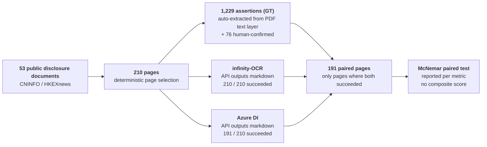

# infinity-OCR Evaluation Brief

> Markdown version of `briefing-deck.html`, same content as the slides, one section per slide. Chinese original: [`../briefing-deck.md`](../briefing-deck.md).
> Structure: conclusion & implications → key numbers → method → comparison → limits & open items. Each slide title is that slide's conclusion.
> Legend: 🟢 yes / supported　🔴 no / not supported　🟡 insufficient evidence or not compared　⚪ not covered

---

## 1 / 5　Parsing quality gives no reason to switch; no difference on key fields for HK disclosures and A-share announcements; A-share statement pages cannot switch at this stage

*INFINITY-OCR vs AZURE DOCUMENT INTELLIGENCE · TECHNICAL EVALUATION BRIEF · 2026-09-28*

### Three conclusions

| | Conclusion | Key number |
|---|---|---|
| **①** | **Quality: Infinity is better on no metric** | Amounts 97.5% vs Azure **100%**; text completeness 93.1% vs **97.1%** (both significant) |
| **②** | **Risk: A-share statement pages silently lose tables** | Whole table segments dropped on 3 pages, **27 amounts** in total; the calls still ended "normally" with no error |
| **③** | **Engineering: no confidence, price unknown** | No way to pick fields for review by confidence; if billed per token, the price must be below **$1.13 / million tokens** to match Azure's list price |

### By document type

| 🟢 No difference on key fields | 🔴 Cannot switch at this stage | 🟡 / ⚪ No conclusion |
|---|---|---|
| HK annual / interim reports / prospectuses; A-share ad-hoc announcements | A-share annual / interim statement & note pages; workflows routing review by confidence; native Word / Excel / PPT / HTML files | HK KYC, scanned pages (insufficient sample or not compared); trade-finance documents (not covered) |

### What this means for the decision

> **A reason to switch can only come from cost or on-premise deployment, not from parsing quality.**
> Cost awaits the vendor's written **quote**; without **version locking** the conclusions cannot be reproduced (open vendor items on slide 5).

*Sample: 53 public disclosure documents → 210 pages → 1,229 assertions, 191 paired pages　·　Source: [evaluation-report.md](evaluation-report.md) §1*

---

## 2 / 5　Azure is significantly better on amounts and text; Infinity is better on nothing

*Same 191 pages, same assertions, paired comparison*

### Four numbers

| Amount accuracy | Silent table loss | Confidence | Cost break-even |
|:---:|:---:|:---:|:---:|
| **97.5%** vs **100%** | **27** amounts · 3 pages | **None** vs **on every span** | **$1.13** / million tokens |
| Infinity vs Azure | Infinity, no error signal | Infinity vs Azure | Below this, matches Azure's $10 / 1,000 pages |

### Assertion pass rates (Infinity vs Azure)

| Metric | n | Infinity | Azure DI | Difference |
|---|---|---|---|---|
| **Amounts** value appears verbatim, correct count | 486 | 97.5% | **100%** | 🔴 significant (0 : 12, p = 0.0005) |
| **Text completeness** 3 body lines per page output verbatim | 448 | 93.1% | **97.1%** | 🔴 significant (2 : 20, p = 0.0001) |
| **Unit & currency** e.g. "Unit: RMB" kept | 93 | 98.9% | 100% | no significant difference observed |
| **Amount on same line as label** | 76 | 100% | 98.7% | no significant difference observed |

*"0 : 12" = assertions only Infinity passed : assertions only Azure passed. Infinity's 12 amount failures checked one by one: 8 genuine omissions, 4 only a different minus glyph.*

### Full amount scan: both miss some, for different reasons

| | Infinity | Azure DI |
|---|---|---|
| Missing among 1,544 amounts on 54 paired pages | 11 · 2 pages | 6 · 2 pages |
| Cause | **Confirmed**: continuation table at page top not output at all; identical in 3 repeat calls | Unknown |
| Outside the paired set | 1 more page lost a whole table (16 amounts) | Gateway failed on that page, no comparison |

*No significant difference at page level; the frequency on both sides needs a larger targeted test　·　Source: [test-results.md](test-results.md)*

---

## 3 / 5　Same pages, same standard, paired comparison: every number is reproducible

*Method*

### Flow

### Why it can be trusted

| | |
|---|---|
| **Public data** | Everything comes from public disclosure channels; anyone can download the same documents |
| **Same yardstick** | Both systems judged by the same assertions, with no conversion of output on our side; punctuation differences handled by a separate relaxed rule, reported side by side |
| **Traceable** | Every Infinity raw response (status code, latency, `finish_reason`, echoed model) saved in full; Azure-side numbers carry checksums |
| **No composite score** | No weighted total; strata with n < 30 are marked "insufficient sample" with no conclusion |
| **Self-correcting** | Round 1's "Infinity 91.3% vs Azure 72.5%" was traced to Azure converting full-width punctuation to half-width, and withdrawn |

### What it cannot measure

Layout coordinates (assertions carry no coordinates), trade-finance documents (no compliant public samples), a two-sided comparison on scanned pages.
Public benchmark olmOCR-Bench: a sample of 120 pages and 604 official tests; Infinity completed all of them, Azure succeeded on only 41 pages, so no pairing was possible, and the pages are not financial documents. The results are only used to align with the vendor's published metric and are not part of the comparison (see [test-results.md](test-results.md) §1.4).

*Sources: [evaluation-report.md](evaluation-report.md) Appendix C　·　[test-results.md](test-results.md)*

---

## 4 / 5　The difference is in failure: Azure reports uncertainty, Infinity delivers anyway

*Comparison · by document type and technical approach*

### By document type (PDF)

| Document type | Judgement | Evidence |
|---|---|---|
| HK annual / interim reports / prospectuses | 🟢 **No difference on key fields** | Neither system failed any amount or label assertion |
| A-share ad-hoc announcements | 🟢 **No difference on key fields** | Neither system failed any amount assertion |
| A-share annual / interim statement & note pages | 🔴 **Cannot switch at this stage** | Infinity deterministically drops tables on continuation pages, with no error; Azure also missed 6, cause unknown |
| HK KYC-type documents | 🟡 Insufficient evidence | Only 39 text assertions, no amount assertions |
| Scanned / skewed pages | 🟡 Not compared with Azure | Infinity on a page skewed by 2° repeated endlessly, hit 32k tokens, output unusable |
| Trade-finance documents | ⚪ Not covered | Current conclusions cannot be extrapolated |

### Four differences that matter for the decision

| | infinity-OCR (VLM) | Azure DI (OCR pipeline) |
|---|---|---|
| **Confidence** | 🔴 None; a `logprobs` request is silently ignored | 🟢 On every text span |
| **When it cannot read** | 🔴 Omits or generates content; the call still ends normally | 🟢 Low confidence or left blank |
| **Version** | 🔴 Only the alias `inf-mllm` is visible; model and version unknown | 🟢 API version number, can be pinned |
| **File formats** | 🔴 PDF and images only | 🟢 Also Word / Excel / PPT / HTML |

*Also: Infinity has open weights (Apache-2.0) and can be deployed on-premise, one possible reason to switch　·　Source: [evaluation-report.md](evaluation-report.md) §1.2, §3*

---

## 5 / 5　Limits and open items: until these are closed, the conclusions are not extrapolated

*Boundaries of this evaluation round*

### No written vendor answer yet

- Tested model and **version**: the server only echoes the alias `inf-mllm`; whether it changed during the evaluation is unknown
- **Billing basis** and quote: without a quote, the cost comparison cannot be completed
- Whether **confidence** can be provided
- Production **throughput and SLA**: the test endpoint gave 1.6–5.6 pages/min, and more concurrency did not help

### Not yet answered by this round's data

- Cause of Azure's 6 missing amounts on A-share amount pages
- Text completeness per document family (only the overall result so far)
- Frequency of table loss on "continuation table at page top" pages: 3 pages so far, needs a larger targeted sample
- HK KYC, scanned / skewed pages: insufficient sample or not compared with Azure
- Trade-finance documents: no compliant public samples, not covered

### Detailed material

| File | Contents |
|---|---|
| [test-results.md](test-results.md) | Test set composition, GT sources, every metric and failure detail, service data, sources of numbers |
| [evaluation-report.md](evaluation-report.md) | Conclusions and evidence, judgement by document type, structural differences, limits of the evaluation, method (Appendix C) |

*Sources: [evaluation-report.md](evaluation-report.md) §1.2, §2　·　[../working/vendor-questions.md](../working/vendor-questions.md)*
